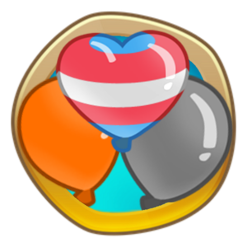
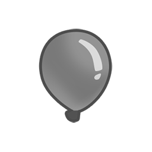
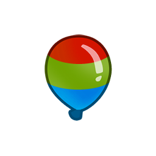
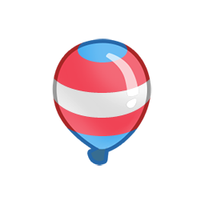
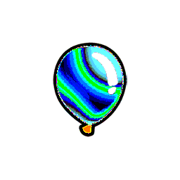
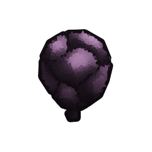
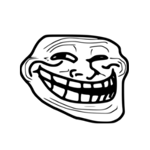

<h1 align="center">MoarBloons</h1>

Adds a variety of new bloons, including a custom modeled moab class bloon. Also adds custom rounds and a gamemode to play with these new bloons!

As of now, the mod is in public beta, version 0.5.0. This means that the rounds only go up to 60 before freeplay, the LMAO bloon is missing damage models and fortify models, and some bloons may not have their planned properties yet (such as the orange bloon).
Hopefully future testing and learning will help me complete this mod.

     
    <h3 align="center">Orange Bloon</h3>
    Immune to acid damage such as alchemist and corrosive glue! Goes faster when glued instead of slower! Pops into 2 pinks.

 

     
    <h3 align="center">Grey Bloon</h3>
    Like a zebra bloon but doesnt have any special properties.

 

     
    <h3 align="center">Pixel Bloon</h3>
    Basically an early rainbow. It pops into one green one blue and one red.

 

     
    <h3 align="center">Trans Bloon</h3>
    Pops into 2 blues, 2 pinks, and 2 whites. Trans rights!

 

     
    <h3 align="center">Mosaic Bloon</h3>
    Essentially an early ceramic, takes 2 hits before it pops into a pixel bloon.

 

     
    <h3 align="center">Obsidian Bloon</h3>
    Has lead, purple, and black properties!

 

     
    <h3 align="center">Cash Bloon</h3>
    A harmless bloon that pops into 100 cash instead of 1!

 

     
    <h3 align="center">LMAO Bloon</h3>
    A MOAB class bloon with double the HP of a MOAB. It also has purple and zebra properties! Pops into several things I can't remember right now.

 

     
    <h3 align="center">????? Bloon</h3>
    ????????????? ???? ??? ?????? ?? ???????

 

